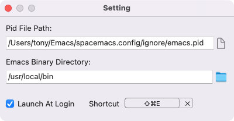
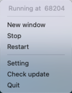

# EmacsCtl

A macos menu bar app which controls the state of emacs deamon process just like systemctl on linux.

### How to use

- First write your emacs pid to file.

    For spacemacs user, just use following code:
    ```elisp
    (unless (spacemacs/system-is-mswindows)
      (let ((pidfile (concat dotspacemacs-ignore-directory "emacs.pid"))
            (pid (number-to-string (emacs-pid))))

        (with-temp-file pidfile
          (message (format "write pid %s to %s" pid pidfile))
          (insert pid))

        (add-hook 'kill-emacs-hook
                  `(lambda ()
                     (with-temp-file ',pidfile)
                      (insert "")))
        )
      )

    (provide 'pidfile)
    ```

- Second configure your pid file path and emacs path.

    

    At least, you should set `Pid File Path` and `Emacs Binary Directory`.

    Also, you can set a shortcut to activate window window.

- Finally control your emacs from status bar menu.

    

### Other

- registry scheme `org-protocol` and forward it to `emacsclient -n`

