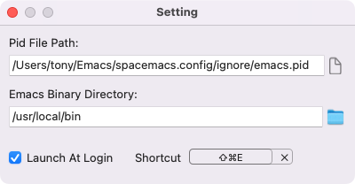
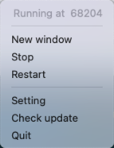

# EmacsCtl

### Features
- Use menu on mac status bar to control(start, restart, new window...) emacs deamon process just like systemctl does on linux.
- Activate emacs window with global shortcut.
  - The shortcut can also run a custom elisp snippet (e.g. to toggle between Emacs and another app) when Emacs is already frontmost.
- Support `org-protocol` scheme so you don't need to create an applescript app to do that.
- Support edit captured content when using `org-roam-protocol`.
- Register EmacsCtl as the default opener for configurable file extensions.
  - Route opens into the running Emacs session via `emacsclient`.
  - Optionally running elisp function for files inside a git repo.
- Native macOS notifications via `emacsctl://notify` URL scheme.
  - Parameters: `title`, `body`, `group`, `actionType`, `actionEval`, `actionDeeplink`.
  - `actionType` defaults to `eval`: clicking evaluates `actionEval`, or focuses Emacs when it is omitted.
  - `noop` does nothing when clicked; `deeplink` opens `actionDeeplink` without evaluating or focusing Emacs.
  - Notifications sharing the same `group` replace each other instead of stacking.
- Save and restore window layouts for multi-monitor setups.
  - Optionally auto-restore when pressing the shortcut if windows have drifted
    (e.g. after wake from sleep).
- Edit the JSON config file directly in Emacs from the status bar menu.
  - External edits are detected and applied live, without restarting the app.
  - Shareable settings live in `~/.config/emacsctl/config.json`; machine-local
    paths, login state, and window layouts live in `~/.config/emacsctl/local.json`.
  - `config.json` may be a symlink; EmacsCtl preserves it when saving and watches
    the resolved target for external changes.

### Install

- Latest app can be downloaded from [Releases](https://github.com/tctony/EmacsCtl/releases) page.
- Or you can clone this project and build your own.

### How to use

- First write your emacs pid to file.

    For spacemacs user, just use following code:
    ```elisp
    (unless (spacemacs/system-is-mswindows)
      (let ((pidfile (concat dotspacemacs-ignore-directory "emacs.pid"))
            (pid (number-to-string (emacs-pid))))

        (with-temp-file pidfile
          (message (format "write pid %s to %s" pid pidfile))
          (insert pid))

        (add-hook 'kill-emacs-hook
                  `(lambda ()
                     (with-temp-file ',pidfile)
                      (insert "")))
        )
      )

    (provide 'pidfile)
    ```

- Second configure your pid file path and emacs path.

    

    At least, you should set `Pid File Path` and `Emacs Binary Directory`.

    Also, you can set a shortcut to activate window window.

- Finally control your emacs from status bar menu.

    
